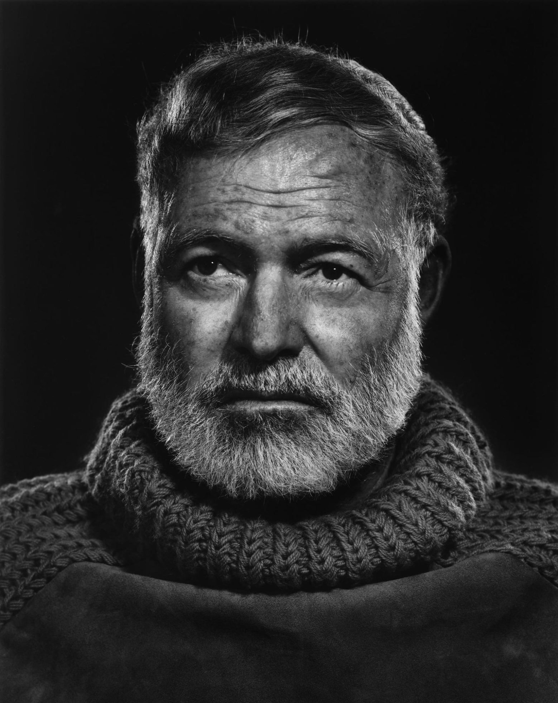

Каждый раз, когда я сажусь писать новый пост, во мне запускается противоречивый процесс. С одной стороны я получаю удовольствие, а с другой стороны — сильно страдаю. Мне не понятно, как лучше структурировать материал, в каком стиле его писать, какие подобрать слова.

А три года назад я страдал так сильно, что даже решился пойти на курс писательского мастерства. Так я попал на курс к Тимуру Аникину. Сейчас Тимур преподаватель в школе дизайна НИУ ВШЭ и автор книги «100 вопросов про твой текст».

Я не буду раскрывать секретов образовательного процесса Тимура, расскажу только о двух самых ярких, по моему мнению, писательских проблемах.

## Две писательских проблемы
У новичков всегда есть две больших проблемы: боязнь чистого листа и микроменеджемент.

Боязнь чистого листа или писательский блок — это состояние паралича, когда ты не можешь «выдавить» из себя ни единого слова, а просто таращишься в «зияющую пустоту» своего блокнота. Ты не можешь решить, с чего начать выражать мысль. Ты бесконечно крутишь в голове несколько мыслей и никак не можешь выбрать, какая же из них лучше всего. 

**Микроменеджмент** — это когда в процессе написания текста ты смешиваешь разные деятельности: «мозговой штурм», написание черновика, исправление опечаток и пунктуации, редактирование, вычитку, и постоянно перескакиваешь с одной деятельности на другую. В итоге, без конца пишешь и переписываешь одно единственное предложение, пытаясь сформулировать его идеально.

Лично мне больше всего проблем доставлял именно микроменеджмент. В этом посте я хочу препарировать именно его.

## Причины микроменеджмента
После того, как я узнал об этапах работы над текстом, я начал замечать, что чаще всего скатываюсь именно к редактуре и корректуре. Но как это происходит? Я обратил внимание, что когда пишу черновик, на свет вылазят мои демоны: внутренний критик и внутренний редактор.

### Внутренний критик
Мерзкий персонаж.  Это он постоянно кричит:

> Уахаха! Смотри, да у тебя текста на два абзаца, все подумают, что ты криворукий неумеха и дилетант. Не позорься! Ты не умеешь развернуть свою мысль дальше одного предложения. Да в этом предложении даже основной идеи нет! Куда ты лезешь?! Убирайся вон из писательства! Уж лучше я тебя сейчас смешаю с дерьмом, чем потом настоящий Ильяхов.

### Внутренний редактор
Постоянно влазит со своими «типа полезными» и заботливыми указаниями:

> Чувак, ну ты че? Там вон дефис пропустил. Тут запятую не поставил. Тут одну «н» написал, а нужно было две. А вон посмотри, там тебе даже текстовый редактор подчеркнул целое предложение красным. А в главред ты потом пойдешь? Ты посмотри! У тебя не предложение, а сплошные абстракции и стоп-слова! Иди исправляй сейчас же! Потом забудешь. А структура в твоем тексте где? Ты что, начал писать без плана? Пипец! Рука-лицо!

Вот из-за этих двух ребят я из раза в раз оказывался на этапе корректуры и редактуры. И чтобы перестать постоянно проваливаться в эту редакторско-корректорскую «черную дыру», есть только один выход: нужно эту парочку либо заткнуть, либо усыпить. Хотя бы на время. Но как?!

## Метод Хемингуэя
Знаменитый писатель Эрнест Хемингуэй однажды сформулировал фразу, которая даже более известна, чем все его романы, и которая в итоге стала заповедью:

> «Пиши пьяным, 
> редактируй трезвым.»

Хемингуэй придумал самый прямолинейный способ заткнуть критика и редактора — напоить их. И ведь действительно, пьяные демоны отвлекутся на что-нибудь другое, потом решат сходить в ближайший демонический алкомаркет «еще за одной», по дороге найдут тему для обсуждения поглобальнее, сходят в алкомаркет еще разок, а потом скорее всего уснут. Идеально!

Но есть загвоздка: что делать, если я не пью?

И можно ли вообще научиться становиться пьяным по желанию, без вина, и только на время работы над черновиком? А потом сразу резко трезветь.

> Можно!

И об этом я расскажу в следующей серии.

## Суммирую
1. Две распространенных проблемы у начинающих писателей: боязнь чистого листа и микроменеджемент
2. Боязнь чистого листа — это паралич и бесконечное прокручивание мыслей в голове
3. Микромендежемент — это постоянное перескакивание с одного этапа писательского процесса на другой
4. Писатели чаще всего скатываются в корректуру и редактирование, вместо работы над черновиком
5. Корень проблемы — внутренний критик и внутренний редактор
6. Чтобы выйти из порочного круга редакторы и корректуры — нужно заткнуть, а лучше напоить редактора и критика. Как завещал Эрнест Хемингуэй.
