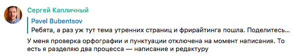
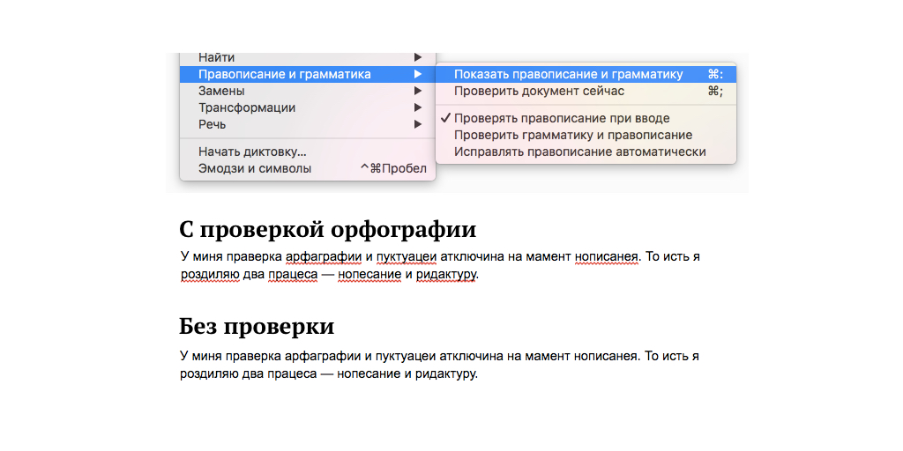
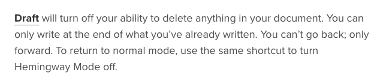
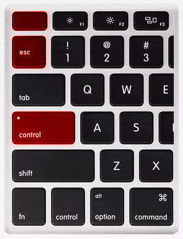
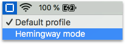
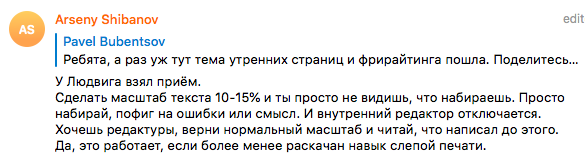
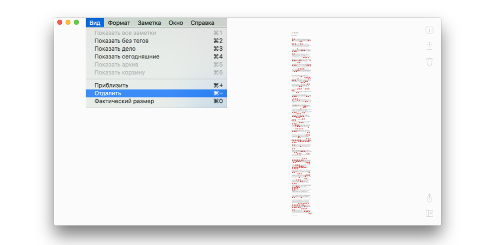

[В прошлой части](/writing-problems) я рассказал о том, что у начинающих писателей две самых серьезных проблемы — это боязнь чистого листа и микроменеджмент. 

В микроменеджменте виноваты **внутренний критик** и **внутренний редактор**. Чтобы избавиться от микроменеджмента, нужно научиться затыкать эту «сладкую парочку». Самый лучший способ их заткнуть придумал Эрнест Хемингуэй: 

> *«Пиши пьяным, редактируй трезвым»*. 

Но Эрнест не рассказал, что делать тем, кто не хочет напиваться ради каждого нового текста.

Поэтому я решил найти способы становиться пьяным писателем, но оставаться трезвым человеком. Я обыскал интернет, спросил умных людей, и мне рассказали о 5 способах:

1. **Способ Олеси Новиковой** (ментальный): мантра перед работой над черновиком «Критик и редактор засыпают, просыпается писатель»
2. **Способ Сергея Капличного**: отключить проверку орфографии и пунктуации
3. **Способ из веб-сервиса Драфт**: отключить возможность удалять текст во время писательской сессии
4. **Мой способ**: стырить идею из Драфта, и временно «сломать» клавишу Бекспейса на клавиатуре с помощью программы Карабинер
5. **Способ Людвига Быстроновского** (топовый): уменьшить масштаб текста до 10-15%, чтобы буквы стали пикселями

Теперь подробнее о каждом способе.

## Способ 1: Критик и редактор засыпают, просыпается писатель

Этот способ я подслушал в 8 выпуске подкаста «Будет сделано». Перед каждой писательской сессией давать себе продуктивную мысленную установку: «Критик и редактор засыпают, просыпается только писатель». Представить, что происходит партия игры в Мафию, наступает ночь, и ведущий партии говорит: «Все засыпают, просыпается только писатель». И пока на дворе ночь, быстренько писать свой черновик. 

Прекрасный способ обмануть внутренних «критиканов». Но временный. Критики не дураки, и рано или поздно поймут, что никакой партии в  «Мафию» на самом деле не происходит, и начнут просыпаться раньше. 

## Способ  2: отключить проверки орфографии и пунктуации

Этим способом со мной поделился Сергей Капличный:

Идея в том, чтобы просто перестать подкидывать визуальные сигналы критику и редактору. Это то же самое, что выключить звуковые и всплывающие оповещения в смартфоне.

Если хотят придираться, то пусть тратят свои личные тексто-распозновательные ресурсы, а не наши общие. 

## Способ 3: использовать режим Хэмингуэя в сервисе Драфт

[Драфт](https://draftin.com/) — это веб-сервис для писателей, во многом похожий на Гугл Докс, но с множеством уникальных фишек.

Режим Хэмингуэя в Драфте отключает любую возможность удаления текста. *Писать текст — пожалуйста! Удалять — извините, не сегодня!* А это значит, что любые указания критика и редактора что-либо исправить будут бессмысленны — исправить ничего нельзя! Физически! Спустя несколько минут безответных выпадов, они все поймут, и уйдут восвояси.

## Способ 4: блокировать клавишу Бекспейс
Я не хотел тратить деньги на подписку в Драфте, поэтому пошел искать бесплатные или опенсорсные решения. И вспомнил про приложение Карабинер, которое позволяет перенастраивать клавиатуру как угодно. Например, чтобы клавиша Капс Лок работала как Контрол, или чтобы Эскейп был на одну клавишу ниже:

Я написал конфигурацию для Карабинера и [выложил ее на Гитхаб](https://github.com/Bazai/hemingway_mode_karabiner). Карабинер вносит нужные настройки в операционной системе, чтобы все нажатия Бекспейса просто игнорировались. Да, этот способ сильно технический, а интерфейс в Карабинере совсем не дружелюбный, но зато все бесплатно и работает в любом текстовом редакторе. И режим Хэмингуэя всегда на расстоянии двух кликов в меню МакОСи.

## Способ 5: уменьшить масштаб текста до 10-15% (топовый)
В чате мне подсказали прием, который использует Людвиг Быстроновский — арт-директор Студии Лебедева:

Действительно, при таком масштабе любой текст становится просто серым кирпичом, а к кирпичам критики и редакторы не придираются. Может быть это обязанность внутреннего прораба, или внутреннего каменотёса, но мне повезло — таких у меня нет.

А если в текстовом редакторе включить подчеркивание ошибок и максимально отдалить текст, то серый кирпич станет наряднее и веселее, и смотреть на него будет приятно. 

Так выглядит мой нарядный кирпич текста в Беаре:

## Ваша очередь

Вот такие 5 способов отключить критика и редактора я нашел и опробовал на себе. Лично для меня самым эффективным оказался способ Людвига. Теперь критик и редактор отключаются мгновенно и я «выливаю» мысли из головы в текстовый редактор в бесшумном режиме.

А теперь ваша очередь: попробуйте эти способы и расскажите, какой для вас сработал лучше всего? Или какие способы используете для этого вы?