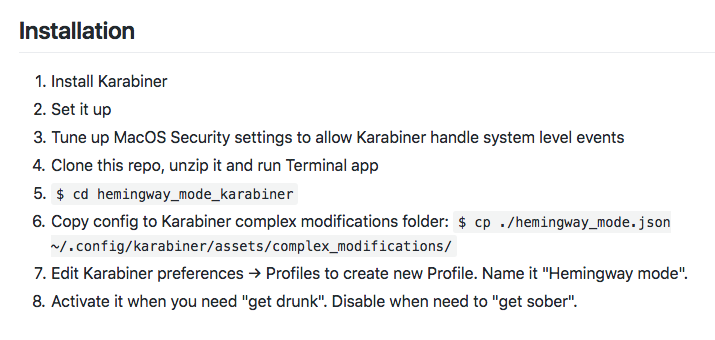

В прошлой части я рассказал о том, что у начинающих писателей две самых больших проблемы — это боязнь чистого листа и микроменеджмент. 

В микроменеджменте виноваты внутренний критик и внутренний редактор. Чтобы избавиться от микроменеджмента, нужно научиться затыкать эту «сладкую парочку». Самый лучший способ их заткнуть придумал Эрнест Хемингуэй: *«Пиши пьяным, редактируй трезвым»*. Но Эрнест не рассказал, что делать тем, кто не хочет напиваться ради каждого нового поста в блог.

Поэтому я решил найти способы становиться пьяным, но оставаться трезвым. И нашел 5 штук.

1. **Способ Олеси Новиковой** (ментальный): мантра перед работой над черновиком «Критик и редактор засыпают, просыпается писатель»
2. **Способ Сергея Капличного**: отключить проверку орфографии и пунктуации
3. **Способ из приложения Драфт**: отключить возможность удалять что либо во время писательской сессии
4. **Мой способ**: стырить идею из Драфта и повторить ее с помощью приложения Карабинер
5. **Способ Людвига Быстроновского**: уменьшить масштаб текста до 10-15%, чтобы буквы стали пикселями

## Способ 1: Критик и редактор засыпают, просыпается писатель

Этот способ я подслушал в 8 выпуске подкаста «Будет сделано». Перед каждой писательской сессией давать себе продуктивную мысленную установку. Я представлял себе, что происходит партия игры в Мафию, наступает ночь, и ведущий партии говорит: «Критик и редактор засыпают, просыпается только писатель». И пока на дворе ночь, я быстренько пишу свой черновик.

## Способ  2: отключить проверки орфографии и пунктуации

Этим способом со мной поделился в телеграме Сергей Капличный:

## Способ 3: использовать режим Хэмингуэя в приложении Драфт
Режим Хэмингуэя в Драфте отключает любую возможность удаления текста. В начале сессии критик и редактор будут пытаться указывать на опечатки и навязывать исправления, но спустя несколько минут поймут, что такая возможность просто перестала существовать в их мире. И уйдут восвояси!

## Способ 4: блокировать клавишу Бекспейс
Я не хотел тратить деньги на подписку в Драфте, поэтому написал конфигурацию для Карабинера и [выложил ее на Гитхаб](https://github.com/Bazai/hemingway_mode_karabiner). Способ сильно технический, а интерфейс в Карабинере не самый дружелюбный. Но зато все бесплатно, работает в любом текстовом редакторе или в любом текстовом поле в браузере.

## Способ 5: уменьшить масштаб текста до 10-15%

## Мой эксперимент

[TODO]: здесь будет график моего прогресса из Google Sheets

В течение месяца я проводил эксперимент и сравнивал все эти способы. Лучше всего у меня сработал способ Людвига. Теперь, когда я пишу черновик, мой текстовый редактор выглядит так:

В тексте много красных подчеркиваний. Критик и редактор рады бы придраться, но они настолько пьяны, что не видят не единой детали. Они просто размахивают руками, «Ааа»-кают, «Эээ»-кают, мычат и кашляют,но в итоге осознают, что их слова никто не понимает, и уходят спать.