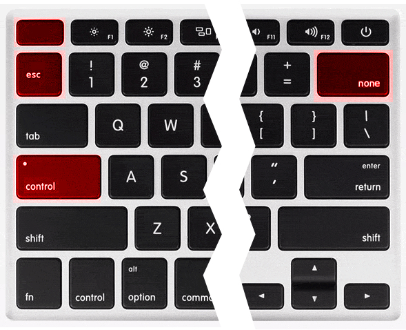

[В прошлой части](/writing-problems) я рассказал о том, что у начинающих писателей две самых больших проблемы — это боязнь чистого листа и микроменеджмент. 

В микроменеджменте виноваты внутренний критик и внутренний редактор. Чтобы избавиться от микроменеджмента, нужно научиться затыкать эту «сладкую парочку». Самый лучший способ их заткнуть придумал Эрнест Хемингуэй: *«Пиши пьяным, редактируй трезвым»*. Но Эрнест не рассказал, что делать тем, кто не хочет напиваться ради каждого нового поста в блог.

Поэтому я решил найти способы становиться пьяным писателем, но оставаться трезвым. Я опросил умных людей и интернет, и мне рассказали о 5 разных способах:

1. **Способ Олеси Новиковой** (ментальный): мантра перед работой над черновиком «Критик и редактор засыпают, просыпается писатель»
2. **Способ Сергея Капличного**: отключить проверку орфографии и пунктуации
3. **Способ из приложения Драфт**: отключить возможность удалять текст во время писательской сессии
4. **Мой способ**: стырить идею из Драфта, и временно «сломать» клавишу Бекспейса на клавиатуре с помощью приложения Карабинер
5. **Способ Людвига Быстроновского**: уменьшить масштаб текста до 10-15%, чтобы буквы стали пикселями

## Способ 1: Критик и редактор засыпают, просыпается писатель

Этот способ я подслушал в 8 выпуске подкаста «Будет сделано». Перед каждой писательской сессией давать себе продуктивную мысленную установку: «Критик и редактор засыпают, просыпается только писатель». Представить, что происходит партия игры в Мафию, наступает ночь, и ведущий партии говорит: «Все засыпают, просыпается только писатель». И пока на дворе ночь, быстренько писать свой черновик. 

Прекрасный способ обмануть внутренних «критиканов». Но, похоже, очень временный. Критики не дураки, и рано или поздно поймут, что никакой партии в  «Мафию» на самом деле не происходит, и начнут просыпаться раньше. 

## Способ  2: отключить проверки орфографии и пунктуации

Этим способом поделился в телеграме Сергей Капличный:

Идея в том, чтобы просто перестать подкидывать визуальные сигналы критику и редактору. Если хотят придираться, то пусть тратят свои тексто-распозновательные ресурсы. Это почти то же самое, что выключить звуковые и визуальные уведомления в телефоне.

## Способ 3: использовать режим Хэмингуэя в сервисе Драфт

Режим Хэмингуэя в Драфте отключает любую возможность удаления текста. А это значит, чтоб любые указания критика и редактора что-либо исправить будут бессмысленны — исправить ничего нельзя! Физически! Спустя несколько минут они это поймут, и уйдут восвояси.

## Способ 4: блокировать клавишу Бекспейс
Я не хотел тратить деньги на подписку в Драфте, поэтому пошел искать бесплатные или опенсорсные решения. И вспомнил про приложение Карабинер, которое позволяет перенастраивать клавиатуру как угодно. Например, чтобы клавиша КапсЛок работала как Контрол, или чтобы Эскейп был на одну клавишу ниже:

Я написал конфигурацию для Карабинера и [выложил ее на Гитхаб](https://github.com/Bazai/hemingway_mode_karabiner). Карабинер вносит нужные настройки в операционной системе, чтобы все нажатия Бекспейса просто игнорировались. Да, этот способ сильно технический, а интерфейс в Карабинере совсем не дружелюбный, но зато все бесплатно и работает в любом текстовом редакторе.

## Способ 5: уменьшить масштаб текста до 10-15%

## Мои выводы

